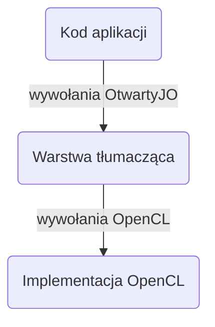

# OtwartyJO

OtwartyJO to w pełni otwartoźródłowe tłumaczenie OpenCL - znanej biblioteki do zrównoleglania obliczeń na platformach heterogenicznych. Projekt pozwala polskim programistom na tworzenie skalowalnych, wysokowydajnościowych aplikacji w ojczystym języku (nareszcie!). OtwartyJO jest wspierany wszędzie tam, gdzie jest wspierany OpenCL, co otwiera drogę do rozwoju aplikacji przy użyciu szerokiego wachlarza platform.

## Architektura
Z uwagi na skomplikowaną architekturę warstwy tłumaczącej, została ona przedstawiona w sposób graficzny na poniższym wykresie. Zaokrąglone prostokąty stanowią moduły aplikacji, natomiast połączenia liniowo-strzałkowe sygnalizują komunikację między poszczególnymi warstwami.


## Przykład użycia
Przykład przedstawia prostą aplikację w języku C wykorzystującą bibliotekę OtwartyJO do wykonania zrownoleglonej operacji sumowania dwóch wektorów i zapisie wyników w trzecim wektorze. Naturalnie poniższy kod należałoby przed wdrożeniem uzupełnić o sprawdzanie błędów.
```c
#include <JO/jo.h>
#include <stdio.h>
#include <string.h>

int main() {
    /* Inicjalizacja */
    jo_identyfikator_platformy platforma = 0;
    joPobierzIdentyfikatoryPlatform(1, &platforma, NULL);
    jo_identyfikator_urzadzenia urzadzenie = 0;
    joPobierzIdentyfikatoryUrzadzenia(platforma, JO_TYP_URZADZENIA_PG, 1, &urzadzenie, NULL);
    jo_kontekst kontekst = joStworzKontekst(NULL, 1, &urzadzenie, NULL, NULL, NULL);
    jo_kolejka_rozkazow kolejka = joStworzKolejkeRozkazowZWlasciwosciami(kontekst, urzadzenie, NULL, NULL);

    /* Stworzenie buforow i wypelnienie danymi */
    rozmiar_t wielkoscDanych = 32;
    jo_liczba dane[wielkoscDanych];
    jo_pamiec buforA = joStworzBufor(kontekst, JO_PAMIEC_PISZ_CZYTAJ, sizeof(dane), NULL, NULL);
    jo_pamiec buforB = joStworzBufor(kontekst, JO_PAMIEC_PISZ_CZYTAJ, sizeof(dane), NULL, NULL);
    jo_pamiec buforC = joStworzBufor(kontekst, JO_PAMIEC_PISZ_CZYTAJ, sizeof(dane), NULL, NULL);
    for (jo_liczba_bz i=0; i < wielkoscDanych; i++) {
        dane[i] = i * 2;
    }
    joZakolejkujPisanieBuforu(kolejka, buforA, JO_PRAWDA, 0, sizeof(dane), dane, 0, NULL, NULL);
    for (jo_liczba_bz i=0; i < wielkoscDanych; i++) {
        dane[i] = i * 3;
    }
    joZakolejkujPisanieBuforu(kolejka, buforB, JO_PRAWDA, 0, sizeof(dane), dane, 0, NULL, NULL);

    /* Stworzenie programu */
    const char *zrodloProgramu = "void __kernel jadro(__global int* buforA, __global int* buforB, __global int* buforC) {\n"
                                 "    int id = get_global_id(0);\n"
                                 "    buforC[id] = buforA[id] + buforB[id];\n"
                                 "}\n";
    rozmiar_t dlugoscZrodlaProgramu = strlen(zrodloProgramu);
    jo_program program = joStworzProgramZeZrodlem(kontekst, 1, &zrodloProgramu, &dlugoscZrodlaProgramu, NULL);
    joBudujProgram(program, 1, &urzadzenie, NULL, NULL, NULL);
    jo_jadro jadro = joStworzJadro(program, "jadro", NULL);
    joUstawArgumentJadra(jadro, 0, sizeof(buforA), &buforA);
    joUstawArgumentJadra(jadro, 1, sizeof(buforB), &buforB);
    joUstawArgumentJadra(jadro, 2, sizeof(buforC), &buforC);

    /* Wykonanie programu i odczytanie wynikow */
    joZakolejkujJadroZakresuND(kolejka, jadro, 1, NULL, &wielkoscDanych, NULL, 0, NULL, NULL);
    joZakolejkujCzytanieBuforu(kolejka, buforC, JO_PRAWDA, 0, sizeof(dane), dane, 0, NULL, NULL);
    for (jo_liczba_bz i=0; i < wielkoscDanych; i++) {
        printf("%d ", dane[i]);
    }
    printf("\n");
}
```
Wynik wykonania:
```
0 5 10 15 20 25 30 35 40 45 50 55 60 65 70 75 80 85 90 95 100 105 110 115 120 125 130 135 140 145 150 155
```

## Użycie w projekcie
Projekt OtwartyJo należy umieścić wśród plików własnego projektu. Do skryptów budujących CMake należy dodać poniższe linie, gdzie TARGET_NAME określa nazwę pliku wykonywalnego aplikacji. Pozwoli to dodać OtwartyJo do procesu budowania tak, aby kompilator mógł odnaleźć pliki nagłówkowe, a linker miał dostęp do pliku binarnego biblioteki.
```
add_subdirectory(OtwartyJo)
target_link_libraries(${TARGET_NAME} OtwartyJo)
```

## Kontrybucje
Z uwagi na ograniczenia budżetu czasowego idącego w parze z wysokim zainteresowaniem projektem, żądania ciągnięcia (potocznie *pull requesty*) będą akceptowane **wyłącznie** raz w roku. Umownie przyjętą datą rozpatrywania kontrybucji jest dzień **1 kwietnia**.
